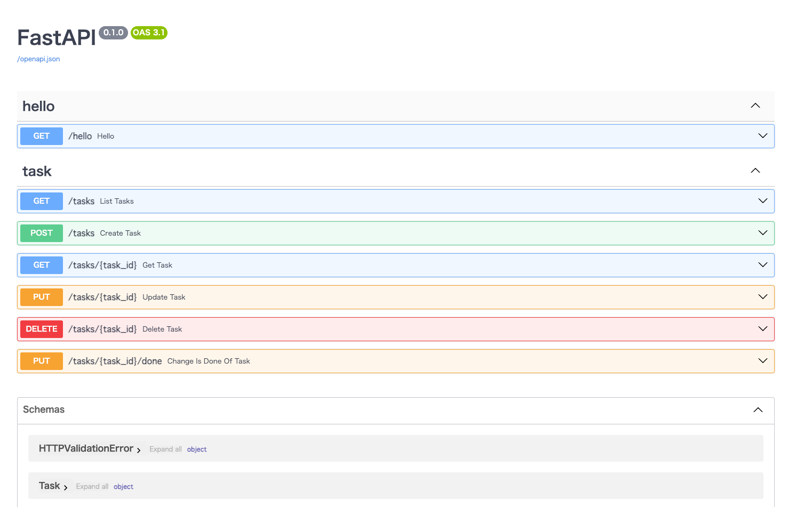

# Getting Started

- [1. Docker Desktop のインストール](#1-docker-desktop-のインストール)
- [2. 環境の作成](#2-環境の作成)
- [3. コンテナの起動・停止・削除](#3-コンテナの起動停止削除)

※ 特に指示がない場合は、コマンドは本レポジトリのルートで実行するようにしてください。

---

<details>
<summary>1. Docker Desktop のインストール</summary>

## 1. Docker Desktop のインストール

以下サイトより、ご自身のローカルマシンにあったものをインストールしてください。

- [Docker Desktop インストール](https://matsuand.github.io/docs.docker.jp.onthefly/get-docker/)

インストールが完了したら起動しておいてください。ローカル環境での起動時に Docker Desktop が起動が必要になります。

</details>

---

<details>
<summary>2. 環境の作成</summary>

## 2. 環境の作成

以下のコマンドを実行してください。

```zsh
$ make setup
```

上記のコマンドにより、以下の処理が実行され環境が構築されます。
- 2つの Docker コンテナ（ Python 用のコンテナとDB用のコンテナ）のビルド。
- Python 用のコンテナに必要な Python パッケージをインストール。
- DBのマイグレーション。

</details>

---

<details>
<summary>3. コンテナの起動・停止・削除</summary>

## 3. コンテナの起動・停止・削除

環境の構築が完了したら、以下のコマンドを実行してください。

```zsh
$ make up
```

正常にコンテナが起動されれば、以下のような出力がされるはずです。


```zsh
$ make up
docker compose up --force-recreate
[+] Running 2/0
 ✔ Container fastapi-sandbox-fastapi-sandbox-1  Recreated    0.0s 
 ✔ Container fastapi-sandbox-db-1               Recreated    0.0s 
Attaching to db-1, fastapi-sandbox-1
```

なお、バックグランドでコンテナを起動したい場合は、上記のコマンドの代わりに以下のコマンドを実行するようにしてください。

```zsh
$ make upd
```

コンテナの起動が確認できたらWebブラウザで [http://localhost:8000/docs#/](http://localhost:8000/docs#/) にアクセスしてください。
問題なければ Swagger UI が立ち上がっており、以下のような無事に表示されます。




最後に作業が完了したら以下のコマンドを実行して、コンテナを停止しておいてください。

```zsh
$ make stop
```

もし、コンテナが不要になったり、再度環境構築が必要になった際は、以下のコマンドを実行してボリュームごとコンテナを削除しておいてください。その際も、「[2. 環境の作成](#2-環境の作成)」の手順から行えば環境構築は大丈夫です。

```zsh
$ make downv
```

以上で環境構築は完了です。お疲れ様でした！


</details>

---
